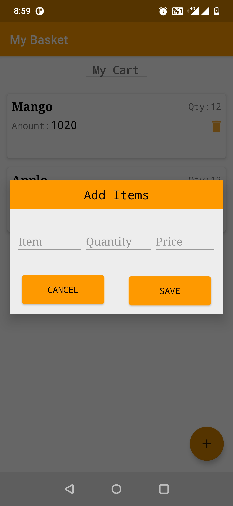

# Android’s Room with MVVM Architecture and Dagger2

Sample app that display list of Grocery Items.The Purpose of the project to illustrate the usage of Room Database with Dagger2 using MVVM architecture
design pattern. 

Including:  
 * Room Database
 * Dagger2 (Dependency Injection)
 * Coroutines
 * LiveData
 * MVVM Architecture

Let’s get understand.

Room Database:Room is Database which is provided by Google and it is provide abstraction layer over SQLite to access data base.Basically it is
used to store data in app.

Dagger2 (Dependency Injection):Dependency injection is used, when one of the objects depends on the concrete implementation of another object.

Coroutines:Coroutines are a lightweight thread, we use a coroutine to perform an operation on other threads, by this our main thread does not block
and your app doesn't crash.

LiveData:A data holder class that can be observed. Always holds/caches latest version of data. Notifies its observers when the data has changed.
LiveData is lifecycle aware. UI components just observe relevant data and don’t stop or resume observation. LiveData automatically manages all
of this since it’s aware of the relevant lifecycle status changes while observing.

MVVM:Provides data to the UI. Acts as a communication center between the Repository and the UI. Hides where the data originates from the UI.
ViewModel instances survive configuration changes.

## Advantages of Room over SQLite?
* In case of SQLite, There is no compile time verification of raw SQLite queries. But in Room there is SQL validation at compile time.
* As your schema changes, you need to update the affected SQL queries manually. Room solves this problem.
* You need to use lots of boilerplate code to convert between SQL queries and Java data objects. But, Room maps our database objects to Java Object without boilerplate code.
* Room is built to work with LiveData and RxJava for data observation, while SQLite does not.
 

## 🚀 Learning Tips:

 There are following simple steps to implement Room Database with Dagger2 using MVVM architecture design pattern.
  - First create Room Database with help of room components(Entity, DAO, Database).
    1. Entity- Created table name and inside this table we have created our columns(like id, itemName, itemQuantity, itemPrice).
    2. DAO- DAO is responsible to perform SQL operations like insert , delete, update etc.
    3. Database- It is database helper class, which is used to provide database name and version, also provide database connection
    open and create database.
  - After create Room Database, all the operations like add items, delete item and display item will be written in Repository class and this will be
    called from viewmodel.
  - For Dependency Injection, create module classes and provide dependencies like Room Database instance, Repository instance, ViewModel factory instance
    inside it. In component all modules need to be added and inside component mention where we want to inject this dependency, then create application class
    and it is used to create dagger setup.
  - Now we can used or provide Dependency where you want.
  - This is simple steps to achieve Room Database with Dagger2 using MVVM architecture design pattern.

## Screenshots
|||
|:----:|:----:|

## Demo

